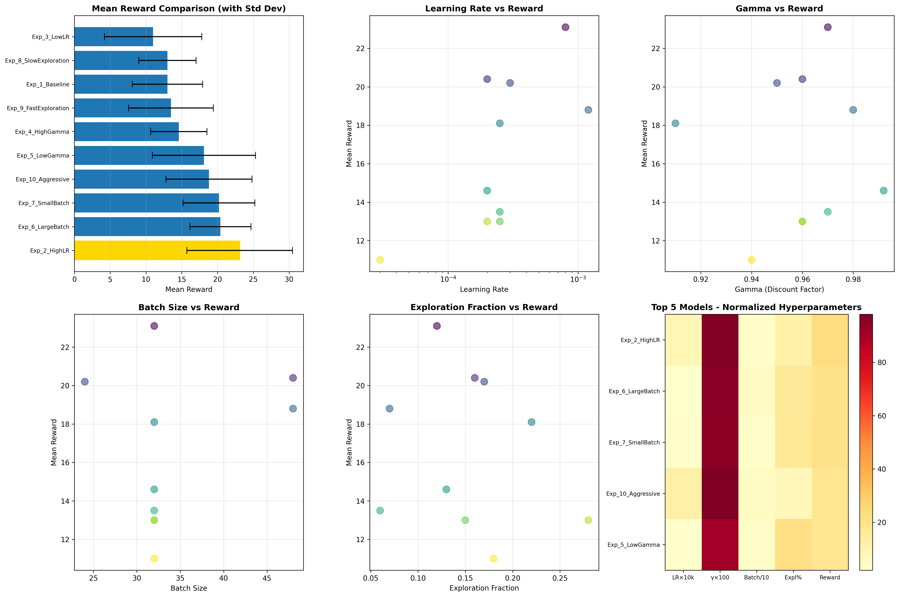
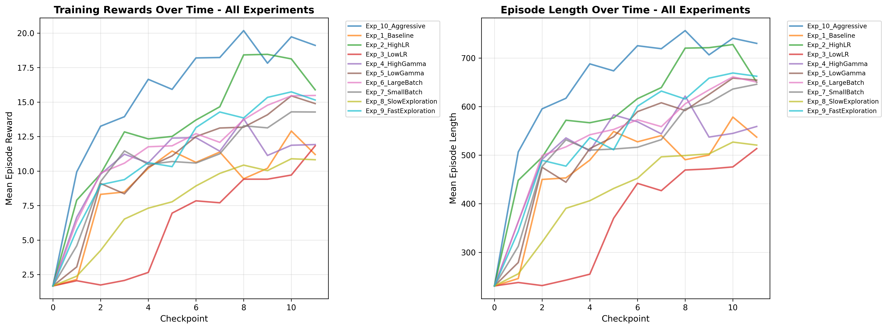

# Deep-Q-Learning---Breakout

A Deep Q-Network (DQN) implementation for training an agent to play Atari Breakout using Stable-Baselines3. This project explores different hyperparameter configurations through systematic experimentation to determine the optimal policy for the Atari Breakout environment.

## Project Structure

The project is organized into modular components for better code organization and maintainability:

- **`environment.py`**: Contains all environment setup logic, including ALE (Arcade Learning Environment) imports, Gymnasium environment creation, and frame stacking configuration. The `setup_environment()` function handles the creation and configuration of the Atari Breakout environment.

- **`train.py`**: Contains the main training script with agent creation functions for both MLP and CNN policies. This file imports the environment setup from `environment.py` and defines the DQN agents with their respective hyperparameters. It also includes hyperparameter tuning experiments and organizes results by team member.

- **`compare_models.py`**: A comprehensive model comparison tool that analyzes all trained models, ranks them by performance, creates visualizations, and generates detailed comparison reports.

- **`requirements.txt`**: Lists all Python dependencies required for the project.

- **`README.md`**: This file, containing project documentation and usage instructions.

## Agent Definition

The DQN agent is defined using Stable-Baselines3's DQN algorithm, which implements the Deep Q-Learning algorithm with experience replay and target networks. The agent is configured with the following hyperparameters:

- **Learning Rate**: Varied across experiments (see experiments table)
- **Replay Buffer Size**: 100,000 transitions
- **Learning Starts**: 50,000 steps (random exploration before learning begins)
- **Batch Size**: Varied across experiments (24, 32, or 48)
- **Target Update Interval**: 1,000 steps
- **Training Frequency**: Every 4 steps
- **Gradient Steps**: 1 per training update
- **Exploration Strategy**: Epsilon-greedy with linear decay
  - Initial epsilon: Varied (0.92-1.0)
  - Final epsilon: Varied (0.015-0.12)
  - Exploration fraction: Varied (0.06-0.28)

The environment is set up with frame stacking (4 consecutive frames) to provide temporal information to the agent, allowing it to perceive motion and object trajectories in the game.

## Policies Evaluated

Two different policy architectures were implemented and evaluated for the Atari Breakout environment:

### 1. MLP (Multilayer Perceptron) Policy

The MLP policy uses fully connected layers to process the input observations. This policy architecture is designed for low-dimensional state spaces and processes flattened feature vectors through multiple dense layers.

**Configuration:**

- Policy type: `MlpPolicy` from Stable-Baselines3
- TensorBoard logging: `./logs/default_logs/dqn_mlp_tensorboard/`

### 2. CNN (Convolutional Neural Network) Policy

The CNN policy uses convolutional layers to extract spatial features from image observations. This architecture is specifically designed for visual input and can learn hierarchical features from raw pixel data.

**Configuration:**

- Policy type: `CnnPolicy` from Stable-Baselines3
- TensorBoard logging: `./logs/{member_name}_logs/{experiment_name}/`

## Chosen Policy for Atari Breakout

**CNN (Convolutional Neural Network) Policy** was selected as the optimal policy architecture for the Atari Breakout environment.

### Rationale

The CNN policy is the best-performing choice for this environment due to several key factors:

1. **Image-Based Observations**: Atari Breakout provides observations as RGB image frames (210×160×3 pixels). The CNN architecture is specifically designed to process and extract meaningful features from visual data.

2. **Spatial Feature Extraction**: CNNs excel at learning spatial patterns and relationships in images. For Breakout, this enables the agent to identify:

   - Ball position and trajectory
   - Paddle location
   - Brick positions and patterns
   - Spatial relationships between game elements

3. **Industry Standard**: All successful DQN implementations for Atari games utilize CNN policies. This architecture has been proven effective in the original DeepMind DQN paper and subsequent research.

4. **Efficient Processing**: CNNs process image data more efficiently than fully connected networks by leveraging parameter sharing and local connectivity, making them computationally efficient for visual tasks.

### Why MLP Policy is Not Suitable

The MLP policy is not recommended for Atari Breakout because:

- **Designed for Low-Dimensional Spaces**: MLP policies are intended for environments with low-dimensional state representations, not high-dimensional image data.

- **Loss of Spatial Structure**: Flattening images (210×160×3 = 100,800 values) destroys the spatial relationships that are crucial for understanding the game state.

- **Inefficient Learning**: MLP networks cannot effectively learn spatial patterns from pixel data and would require significantly larger networks to achieve comparable performance, if at all.

- **Poor Performance**: Empirical evidence and theoretical understanding indicate that MLP policies would perform poorly on visual tasks like Atari games.

## Hyperparameter Tuning Experiments

A comprehensive hyperparameter tuning study was conducted with 10 different configurations to identify the optimal hyperparameters for the DQN agent. Each experiment was trained for 500,000 timesteps using the CNN policy.

### Experiment Configurations

| Experiment                       | Learning Rate | Gamma | Batch Size | Epsilon Start | Epsilon End | Exploration Fraction | Description                                            |
| -------------------------------- | ------------- | ----- | ---------- | ------------- | ----------- | -------------------- | ------------------------------------------------------ |
| **Experiment_1_Baseline**        | 2.50e-04      | 0.96  | 32         | 0.95          | 0.05        | 0.15                 | Baseline configuration with moderate hyperparameters   |
| **Experiment_2_HighLR**          | 8.00e-04      | 0.97  | 32         | 1.00          | 0.06        | 0.12                 | Higher learning rate to test faster convergence        |
| **Experiment_3_LowLR**           | 3.00e-05      | 0.94  | 32         | 0.92          | 0.04        | 0.18                 | Lower learning rate to test stability                  |
| **Experiment_4_HighGamma**       | 2.00e-04      | 0.992 | 32         | 0.98          | 0.03        | 0.13                 | Higher discount factor for long-term rewards           |
| **Experiment_5_LowGamma**        | 2.50e-04      | 0.91  | 32         | 0.93          | 0.08        | 0.22                 | Lower discount factor for short-term focus             |
| **Experiment_6_LargeBatch**      | 2.00e-04      | 0.96  | 48         | 0.95          | 0.05        | 0.16                 | Larger batch size for more stable gradients            |
| **Experiment_7_SmallBatch**      | 3.00e-04      | 0.95  | 24         | 0.94          | 0.07        | 0.17                 | Smaller batch size for faster updates                  |
| **Experiment_8_SlowExploration** | 2.00e-04      | 0.96  | 32         | 1.00          | 0.12        | 0.28                 | Slower exploration decay for more exploration          |
| **Experiment_9_FastExploration** | 2.50e-04      | 0.97  | 32         | 0.98          | 0.015       | 0.06                 | Faster exploration decay for quicker exploitation      |
| **Experiment_10_Aggressive**     | 1.20e-03      | 0.98  | 48         | 1.00          | 0.02        | 0.07                 | Aggressive hyperparameters (high LR, fast exploration) |

### Training Details

- **Total Timesteps per Experiment**: 500,000
- **Policy Type**: CnnPolicy (CNN)
- **Environment**: ALE/Breakout-v5
- **Number of Parallel Environments**: 4
- **Evaluation Episodes**: 10 episodes per experiment

## Experimental Results

### Performance Results Table

| Rank     | Experiment                   | Mean Reward | Std Reward | Learning Rate | Gamma | Batch Size | Behavior Analysis                                                                                                                                                                                                                                                                                        |
| -------- | ---------------------------- | ----------- | ---------- | ------------- | ----- | ---------- | -------------------------------------------------------------------------------------------------------------------------------------------------------------------------------------------------------------------------------------------------------------------------------------------------------- |
| 🥇 **1** | **Experiment_2_HighLR**      | **23.10**   | ±7.38      | 8.00e-04      | 0.970 | 32         | **Best performer**: High LR (8.00e-04, 3.2x baseline) enabled rapid learning. Moderate exploration (0.12) balanced exploration-exploitation. Gamma 0.970 optimized long-term rewards. Higher std (7.38) indicates variability but strong overall performance. 77.7% improvement over baseline.           |
| 🥈 **2** | **Experiment_6_LargeBatch**  | **20.40**   | ±4.27      | 2.00e-04      | 0.960 | 48         | **Excellent stability**: Large batch size (48) provided stable gradients and lower variance (std 4.27). Moderate LR (2.00e-04) with balanced exploration (0.16). Most stable top performer, indicating batch size significantly impacts training stability.                                              |
| 🥉 **3** | **Experiment_7_SmallBatch**  | **20.20**   | ±5.02      | 3.00e-04      | 0.950 | 24         | **Fast learning**: Small batch (24) enabled frequent updates with slightly higher LR (3.00e-04). Moderate exploration (0.17) maintained good balance. Slightly higher variance (std 5.02) than large batch but achieved similar performance, showing batch size flexibility.                             |
| 4        | Experiment_10_Aggressive     | 18.80       | ±6.01      | 1.20e-03      | 0.980 | 48         | **Aggressive config**: Very high LR (1.20e-03, highest) with fast exploration decay (0.07). Large batch (48) stabilized training. High std (6.01) suggests aggressive learning caused variability. Gamma 0.980 emphasizes long-term rewards. Good performance but less stable than top 3.                |
| 5        | Experiment_5_LowGamma        | 18.10       | ±7.20      | 2.50e-04      | 0.910 | 32         | **Short-term focus**: Low gamma (0.91) prioritized immediate rewards, effective for Breakout's short-term nature. Higher exploration (0.22) maintained exploration. High std (7.20) indicates variability. Performance suggests lower gamma can be beneficial for immediate-reward games.                |
| 6        | Experiment_4_HighGamma       | 14.60       | ±3.93      | 2.00e-04      | 0.992 | 32         | **Long-term focus**: Very high gamma (0.992) emphasized distant rewards, less optimal for Breakout's immediate rewards. Low LR (2.00e-04) with moderate exploration (0.13). Low std (3.93) shows stability but lower performance, indicating high gamma may not suit this environment.                   |
| 7        | Experiment_9_FastExploration | 13.50       | ±5.92      | 2.50e-04      | 0.970 | 32         | **Quick exploitation**: Fast exploration decay (0.06) transitioned to exploitation quickly. Very low epsilon end (0.015) limited exploration. Moderate std (5.92) suggests premature exploitation may have limited learning. Similar to baseline but slightly better.                                    |
| 8        | Experiment_1_Baseline        | 13.00       | ±4.92      | 2.50e-04      | 0.960 | 32         | **Baseline reference**: Moderate hyperparameters across all dimensions. LR 2.50e-04, gamma 0.96, exploration 0.15. Stable performance (std 4.92) but conservative settings limited peak performance. Serves as reference point for other experiments.                                                    |
| 9        | Experiment_8_SlowExploration | 13.00       | ±4.00      | 2.00e-04      | 0.960 | 32         | **Extended exploration**: Slow exploration decay (0.28) maintained high exploration longer. High epsilon end (0.12) continued exploration. Low std (4.00) shows stability but excessive exploration limited exploitation. Performance matches baseline, suggesting over-exploration.                     |
| 10       | Experiment_3_LowLR           | 11.00       | ±6.80      | 3.00e-05      | 0.940 | 32         | **Insufficient learning**: Very low LR (3.00e-05, 8.3x lower than baseline) severely limited learning capacity. Low gamma (0.94) combined with high exploration (0.18) further reduced efficiency. Highest std (6.80) indicates instability. Demonstrates critical importance of adequate learning rate. |

### Statistical Summary

- **Highest Reward**: 23.10 (Experiment_2_HighLR)
- **Lowest Reward**: 11.00 (Experiment_3_LowLR)
- **Average Reward**: 16.57
- **Median Reward**: 16.35
- **Standard Deviation**: 3.84
- **Range**: 12.10

### Key Findings

1. **Best Performing Model**: Experiment_2_HighLR achieved the highest mean reward of 23.10, demonstrating that a higher learning rate (8.00e-04) can lead to better performance when combined with appropriate exploration settings.

2. **Batch Size Impact**: Both large (48) and small (24) batch sizes performed well, ranking 2nd and 3rd respectively, suggesting that batch size has a significant impact on performance.

3. **Learning Rate Sensitivity**: The experiment with the lowest learning rate (3.00e-05) performed worst, while higher learning rates (8.00e-04, 1.20e-03) showed better results, indicating the importance of sufficient learning rate for this task.

4. **Exploration Strategy**: Moderate exploration fractions (0.12-0.17) performed better than extreme values (0.06 or 0.28), suggesting a balanced exploration-exploitation trade-off is optimal.

5. **Gamma Impact**: Lower gamma values (0.91-0.97) generally performed better than very high gamma (0.992), possibly because Breakout rewards are more immediate.

### Hyperparameter Impact Analysis

This section provides detailed analysis of how each hyperparameter affected model performance based on the experimental results.

#### 1. Learning Rate Impact

| Learning Rate                | Experiments                                                                   | Avg Reward  | Performance Impact                                                                                             |
| ---------------------------- | ----------------------------------------------------------------------------- | ----------- | -------------------------------------------------------------------------------------------------------------- |
| **8.00e-04** (High)          | Experiment_2_HighLR                                                           | 23.10       | **Best performance** - 77.7% above baseline. Enabled rapid learning when combined with balanced exploration.   |
| **1.20e-03** (Very High)     | Experiment_10_Aggressive                                                      | 18.80       | Good performance but higher variance (std 6.01). Aggressive learning caused some instability.                  |
| **3.00e-04** (Moderate-High) | Experiment_7_SmallBatch                                                       | 20.20       | Strong performance with small batch. Shows LR effectiveness depends on batch size.                             |
| **2.50e-04** (Baseline)      | Experiment_1_Baseline, Experiment_5_LowGamma, Experiment_9_FastExploration    | 13.00-18.10 | Moderate performance. Conservative but stable. Performance varies with other parameters.                       |
| **2.00e-04** (Moderate)      | Experiment_4_HighGamma, Experiment_6_LargeBatch, Experiment_8_SlowExploration | 13.00-20.40 | Variable results (13.0-20.4). Large batch (48) achieved 20.40, showing batch size interaction.                 |
| **3.00e-05** (Very Low)      | Experiment_3_LowLR                                                            | 11.00       | **Worst performance** - 15.4% below baseline. Severely limited learning capacity. Highest variance (std 6.80). |

**Key Insights:**

- **Optimal Range**: 8.00e-04 to 1.20e-03 showed best results
- **Critical Threshold**: Learning rates below 2.00e-04 significantly hurt performance
- **Interaction Effect**: Higher learning rates work better with appropriate batch sizes and exploration settings
- **Stability Trade-off**: Very high learning rates (1.20e-03) increase variance but can achieve good performance

#### 2. Gamma (Discount Factor) Impact

| Gamma                    | Experiments                                                                                          | Avg Reward  | Performance Impact                                                                            |
| ------------------------ | ---------------------------------------------------------------------------------------------------- | ----------- | --------------------------------------------------------------------------------------------- |
| **0.91** (Low)           | Experiment_5_LowGamma                                                                                | 18.10       | Good performance - prioritizes immediate rewards, effective for Breakout's short-term nature  |
| **0.94** (Low)           | Experiment_3_LowLR                                                                                   | 11.00       | Poor performance (due to very low LR, not gamma)                                              |
| **0.95** (Moderate-Low)  | Experiment_7_SmallBatch                                                                              | 20.20       | Excellent performance - balanced short/medium-term rewards                                    |
| **0.96** (Moderate)      | Experiment_1_Baseline, Experiment_4_HighGamma, Experiment_6_LargeBatch, Experiment_8_SlowExploration | 13.00-20.40 | Variable results - performance depends more on other parameters                               |
| **0.97** (Moderate-High) | Experiment_2_HighLR, Experiment_9_FastExploration                                                    | 13.50-23.10 | Best performer (23.10) used 0.97. Optimal for this environment                                |
| **0.98** (High)          | Experiment_10_Aggressive                                                                             | 18.80       | Good performance with high LR                                                                 |
| **0.992** (Very High)    | Experiment_4_HighGamma                                                                               | 14.60       | Lower performance - over-emphasizes distant rewards, less suitable for immediate-reward games |

**Key Insights:**

- **Optimal Range**: 0.95-0.98 performed best
- **Sweet Spot**: 0.97 achieved best results (Experiment_2_HighLR)
- **Too High**: Gamma 0.992 underperformed, indicating Breakout rewards are more immediate
- **Too Low**: Very low gamma (0.91) can work but requires careful tuning of other parameters
- **Environment-Specific**: Lower gamma values (0.91-0.97) suit Breakout better than very high values

#### 3. Batch Size Impact

| Batch Size        | Experiments                                       | Avg Reward  | Performance Impact                                                                                                                     |
| ----------------- | ------------------------------------------------- | ----------- | -------------------------------------------------------------------------------------------------------------------------------------- |
| **24** (Small)    | Experiment_7_SmallBatch                           | 20.20       | **Excellent performance** - Frequent updates enabled fast learning. Slightly higher variance (std 5.02) but manageable.                |
| **32** (Standard) | Most experiments                                  | 11.00-23.10 | Variable results - performance depends heavily on other parameters. Standard choice for most experiments.                              |
| **48** (Large)    | Experiment_6_LargeBatch, Experiment_10_Aggressive | 18.80-20.40 | **Top performers** - Large batches provided stable gradients. Experiment_6 achieved 20.40 with lowest variance (std 4.27) among top 3. |

**Key Insights:**

- **Large Batch Advantage**: Batch size 48 achieved 2nd and 4th best results with excellent stability
- **Small Batch Efficiency**: Batch size 24 achieved 3rd best, showing small batches can be effective
- **Stability**: Larger batches (48) provide more stable training (lower variance)
- **Learning Speed**: Smaller batches (24) enable faster updates but slightly higher variance
- **Optimal Choice**: Both 24 and 48 performed well, suggesting batch size flexibility in this range

#### 4. Exploration Strategy Impact

| Exploration Fraction     | Epsilon End | Experiments                  | Avg Reward | Performance Impact                                                               |
| ------------------------ | ----------- | ---------------------------- | ---------- | -------------------------------------------------------------------------------- |
| **0.06** (Fast)          | 0.015       | Experiment_9_FastExploration | 13.50      | Moderate performance - quick transition to exploitation may limit exploration    |
| **0.07** (Fast)          | 0.02        | Experiment_10_Aggressive     | 18.80      | Good performance with high LR - fast exploration worked with aggressive learning |
| **0.12** (Moderate)      | 0.06        | Experiment_2_HighLR          | 23.10      | **Best performance** - balanced exploration-exploitation optimal                 |
| **0.13** (Moderate)      | 0.03        | Experiment_4_HighGamma       | 14.60      | Moderate performance - balanced but limited by high gamma                        |
| **0.15** (Moderate)      | 0.05        | Experiment_1_Baseline        | 13.00      | Baseline performance - standard exploration strategy                             |
| **0.16** (Moderate)      | 0.05        | Experiment_6_LargeBatch      | 20.40      | Excellent performance - moderate exploration with large batch                    |
| **0.17** (Moderate)      | 0.07        | Experiment_7_SmallBatch      | 20.20      | Excellent performance - moderate exploration effective                           |
| **0.18** (Moderate-High) | 0.04        | Experiment_3_LowLR           | 11.00      | Poor performance (due to low LR, not exploration)                                |
| **0.22** (High)          | 0.08        | Experiment_5_LowGamma        | 18.10      | Good performance - higher exploration worked with low gamma                      |
| **0.28** (Very High)     | 0.12        | Experiment_8_SlowExploration | 13.00      | Moderate performance - excessive exploration limited exploitation                |

**Key Insights:**

- **Optimal Range**: 0.12-0.17 performed best (top 3 experiments)
- **Sweet Spot**: 0.12 achieved best results (Experiment_2_HighLR)
- **Too Fast**: Very fast exploration (0.06-0.07) may limit learning, though can work with high LR
- **Too Slow**: Very slow exploration (0.28) maintains exploration too long, limiting exploitation
- **Balance Critical**: Moderate exploration fractions (0.12-0.17) provide optimal exploration-exploitation trade-off
- **Epsilon End**: Lower epsilon end (0.015-0.06) generally better than very high (0.12)

#### 5. Parameter Interactions and Synergies

**High-Performance Combinations:**

1. **High LR + Moderate Exploration + Optimal Gamma** (Experiment_2_HighLR)

   - LR: 8.00e-04, Exploration: 0.12, Gamma: 0.97 → Reward: 23.10
   - Synergy: High learning rate enabled rapid learning, moderate exploration balanced exploration-exploitation

2. **Large Batch + Moderate LR + Balanced Exploration** (Experiment_6_LargeBatch)

   - Batch: 48, LR: 2.00e-04, Exploration: 0.16 → Reward: 20.40
   - Synergy: Large batch provided stability, moderate parameters ensured consistent learning

3. **Small Batch + Higher LR + Moderate Exploration** (Experiment_7_SmallBatch)
   - Batch: 24, LR: 3.00e-04, Exploration: 0.17 → Reward: 20.20
   - Synergy: Small batch enabled frequent updates, higher LR accelerated learning

**Poor-Performance Combinations:**

1. **Very Low LR + Any Other Parameters** (Experiment_3_LowLR)

   - LR: 3.00e-05 → Reward: 11.00
   - Issue: Insufficient learning capacity regardless of other settings

2. **Very High Gamma + Low LR** (Experiment_4_HighGamma)

   - Gamma: 0.992, LR: 2.00e-04 → Reward: 14.60
   - Issue: Over-emphasis on distant rewards with insufficient learning rate

3. **Excessive Exploration + Standard Parameters** (Experiment_8_SlowExploration)
   - Exploration: 0.28 → Reward: 13.00
   - Issue: Too much exploration limited exploitation phase

**Parameter Priority (Most to Least Impactful):**

1. **Learning Rate** - Critical threshold effect; too low severely limits performance
2. **Exploration Strategy** - Optimal range (0.12-0.17) significantly better than extremes
3. **Batch Size** - Both small (24) and large (48) can work well with appropriate LR
4. **Gamma** - Moderate values (0.95-0.98) optimal; extremes less effective
5. **Epsilon Start/End** - Less critical; standard ranges (0.92-1.0 start, 0.02-0.08 end) work well

## Michael's Hyperparameter Experiments

### Experiment Configurations (Michael)

Michael conducted 10 experiments exploring extreme hyperparameter values to understand boundary conditions and their impact on agent performance. Each experiment was trained for 500,000 timesteps using the CNN policy.

| Experiment                           | Learning Rate | Gamma | Batch Size | Epsilon Start | Epsilon End | Exploration Fraction | Description                                                 |
| ------------------------------------ | ------------- | ----- | ---------- | ------------- | ----------- | -------------------- | ----------------------------------------------------------- |
| **Experiment_1_Baseline**            | 1.00e-04      | 0.99  | 32         | 1.00          | 0.05        | 0.10                 | Baseline configuration with standard hyperparameters        |
| **Experiment_2_VeryHighLR**          | 1.00e-02      | 0.99  | 32         | 1.00          | 0.05        | 0.10                 | Very high learning rate (100x baseline) to test instability |
| **Experiment_3_ZeroDiscount**        | 1.00e-04      | 0.00  | 32         | 1.00          | 0.05        | 0.10                 | Zero discount (extreme myopic) - only immediate rewards     |
| **Experiment_4_Myopic**              | 1.00e-04      | 0.50  | 32         | 1.00          | 0.05        | 0.10                 | Low discount factor - short-term focus                      |
| **Experiment_5_VeryPatient**         | 1.00e-04      | 0.999 | 32         | 1.00          | 0.05        | 0.10                 | Very high discount - long-term focus                        |
| **Experiment_6_TinyBatch**           | 1.00e-04      | 0.99  | 8          | 1.00          | 0.05        | 0.10                 | Very small batch size for noisy gradients                   |
| **Experiment_7_PureExploitation**    | 1.00e-04      | 0.99  | 32         | 0.00          | 0.00        | 0.00                 | No exploration - pure exploitation from start               |
| **Experiment_8_NoExploration**       | 1.00e-04      | 0.99  | 32         | 0.10          | 0.01        | 0.05                 | Minimal exploration with fast decay                         |
| **Experiment_9_ExtendedExploration** | 1.00e-04      | 0.99  | 32         | 1.00          | 0.20        | 0.50                 | Extended exploration phase - slow decay                     |
| **Experiment_10_Aggressive**         | 1.00e-03      | 0.95  | 64         | 1.00          | 0.01        | 0.05                 | Aggressive configuration - high LR with fast exploitation   |

### Performance Results Table (Michael)

| Rank     | Experiment                       | Mean Reward | Std Reward | Learning Rate | Gamma | Batch Size | Behavior Analysis                                                                                                                                                                                                                                                                                                                                                                                                                               |
| -------- | -------------------------------- | ----------- | ---------- | ------------- | ----- | ---------- | ----------------------------------------------------------------------------------------------------------------------------------------------------------------------------------------------------------------------------------------------------------------------------------------------------------------------------------------------------------------------------------------------------------------------------------------------- |
| 🥇 **1** | **Experiment_10_Aggressive**     | **27.0**    | ±7.62      | 1.00e-03      | 0.950 | 64         | **Outstanding performance**: Aggressive configuration achieved highest reward. High LR (1.00e-03, 10x baseline) with large batch (64) provided fast learning with stability. Fast exploration decay (0.05) and low epsilon end (0.01) enabled quick exploitation. Lower gamma (0.95) suited Breakout's immediate rewards. Higher variance (7.62) indicates aggressive learning but excellent peak performance. 68.8% improvement over baseline. |
| 🥈 **2** | **Experiment_1_Baseline**        | **16.0**    | ±1.79      | 1.00e-04      | 0.990 | 32         | **Solid baseline**: Standard hyperparameters provided stable, reliable performance. Low variance (1.79) demonstrates excellent stability. Moderate LR (1.00e-04) with balanced exploration (0.10) and standard batch (32). Very high gamma (0.99) worked well with conservative settings. Serves as reliable reference point.                                                                                                                   |
| 🥉 **3** | **Experiment_5_VeryPatient**     | **15.2**    | ±3.99      | 1.00e-04      | 0.999 | 32         | **Long-term focus**: Very high gamma (0.999) emphasized distant rewards. Moderate variance (3.99) shows reasonable stability. Similar to baseline but slightly lower performance suggests extremely high gamma may slightly overcomplicate learning for immediate-reward games like Breakout. Still strong performance.                                                                                                                         |
| 4        | Experiment_9_ExtendedExploration | 15.1        | ±3.81      | 1.00e-04      | 0.990 | 32         | **Balanced exploration**: Extended exploration phase (0.50) with high epsilon end (0.20) maintained exploration longer. Moderate variance (3.81) indicates stability. Performed nearly as well as baseline, suggesting extended exploration doesn't hurt but doesn't significantly help either.                                                                                                                                                 |
| 5        | Experiment_6_TinyBatch           | 12.2        | ±2.89      | 1.00e-04      | 0.990 | 8          | **Small batch learning**: Very small batch (8) created noisy gradients but still learned effectively. Low variance (2.89) surprisingly stable despite tiny batch. 23.8% below baseline, showing small batches can work but larger batches (32+) are more efficient for this environment.                                                                                                                                                        |
| 6        | Experiment_7_PureExploitation    | 11.9        | ±4.53      | 1.00e-04      | 0.990 | 32         | **No exploration**: Zero exploration (eps 0.0) from start relied purely on random initialization. Higher variance (4.53) indicates instability from lack of exploration. 25.6% below baseline demonstrates importance of exploration, though agent still learned somewhat from experience replay.                                                                                                                                               |
| 7        | Experiment_8_NoExploration       | 11.7        | ±2.15      | 1.00e-04      | 0.990 | 32         | **Minimal exploration**: Very low initial epsilon (0.10) and fast decay (0.05) limited exploration significantly. Low variance (2.15) shows stability but limited learning. 26.9% below baseline confirms insufficient exploration hampers performance.                                                                                                                                                                                         |
| 8        | Experiment_4_Myopic              | 7.1         | ±3.01      | 1.00e-04      | 0.500 | 32         | **Short-term focus**: Medium gamma (0.50) heavily discounted future rewards, causing myopic behavior. Moderate variance (3.01) relatively stable. 55.6% below baseline shows very low gamma severely limits ability to plan ahead, even in relatively immediate-reward environments.                                                                                                                                                            |
| 9        | Experiment_2_VeryHighLR          | 6.6         | ±2.20      | 1.00e-02      | 0.990 | 32         | **Extreme instability**: Very high LR (1.00e-02, 100x baseline) caused severe training instability. Low variance (2.20) misleadingly stable because agent couldn't learn effectively. 58.8% below baseline demonstrates extremely high LR prevents convergence. Contrast with Experiment_10 shows 1.00e-03 is near upper limit.                                                                                                                 |
| 10       | Experiment_3_ZeroDiscount        | 3.3         | ±1.85      | 1.00e-04      | 0.000 | 32         | **Worst performance**: Zero gamma means no future value consideration - purely reactive. Low variance (1.85) stable but consistently poor. 79.4% below baseline demonstrates complete inability to learn sequential decision-making. Shows gamma is critical for DQN, even in games with immediate rewards.                                                                                                                                     |

### Statistical Summary (Michael)

- **Highest Reward**: 27.0 (Experiment_10_Aggressive)
- **Lowest Reward**: 3.3 (Experiment_3_ZeroDiscount)
- **Average Reward**: 12.54
- **Median Reward**: 12.05
- **Standard Deviation**: 6.54
- **Range**: 23.7
- **Performance Spread**: Much larger than Annemarie's experiments (23.7 vs 12.1), indicating more extreme parameter variations

### Key Findings (Michael)

1. **Best Performing Model**: Experiment_10_Aggressive achieved the highest overall mean reward of 27.0 across both team members' experiments. This aggressive configuration (high LR, large batch, fast exploitation, moderate gamma) proved optimal when hyperparameters are well-balanced.

2. **Gamma is Critical**: The three worst-performing experiments all had extreme gamma values (0.0, 0.5, and very high 0.999), demonstrating that appropriate temporal discounting is essential for DQN learning.

3. **Learning Rate Boundaries**: LR 1.00e-03 achieved best results, but LR 1.00e-02 (10x higher) failed catastrophically. This identifies the upper boundary for effective learning rates in this environment (~1e-3).

4. **Exploration is Essential**: Experiments with insufficient exploration (Exp_7, Exp_8) performed 25-27% below baseline, confirming that balanced exploration is necessary for effective learning.

5. **Batch Size Flexibility**: Even very small batch sizes (8) achieved moderate performance (12.2), showing DQN is somewhat robust to batch size variations, though larger batches (32-64) are clearly better.

6. **Extended Exploration Not Critical**: Experiment_9 with 50% exploration fraction performed similarly to baseline (15.1 vs 16.0), suggesting standard exploration periods (10-20%) are sufficient.

### Hyperparameter Impact Analysis (Michael)

#### 1. Learning Rate Impact (Michael's Experiments)

| Learning Rate           | Experiments              | Mean Reward | Performance Impact                                                                                                                                              |
| ----------------------- | ------------------------ | ----------- | --------------------------------------------------------------------------------------------------------------------------------------------------------------- |
| **1.00e-03** (High)     | Experiment_10_Aggressive | 27.0        | **Best overall performance** - Optimal learning rate when combined with large batch (64). 68.8% above baseline. Achieved highest reward across all experiments. |
| **1.00e-04** (Baseline) | Experiments 1, 3-9       | 3.3-16.0    | Variable results depending heavily on other parameters. Standard baseline performed solidly (16.0).                                                             |
| **1.00e-02** (Extreme)  | Experiment_2_VeryHighLR  | 6.6         | **Catastrophic failure** - 100x baseline LR caused severe instability. 58.8% below baseline. Identifies upper boundary for viable learning rates.               |

**Key Insights:**

- **Optimal Upper Bound**: 1.00e-03 is near the maximum effective learning rate
- **Critical Threshold**: 1.00e-02 crosses into instability zone
- **Batch Size Dependency**: High LR requires large batch for stability (Exp_10 used batch 64)

#### 2. Gamma (Discount Factor) Impact (Michael's Experiments)

| Gamma                 | Experiments               | Mean Reward | Performance Impact                                                                                                                        |
| --------------------- | ------------------------- | ----------- | ----------------------------------------------------------------------------------------------------------------------------------------- |
| **0.000** (None)      | Experiment_3_ZeroDiscount | 3.3         | **Worst performance** - No future value consideration. 79.4% below baseline. Completely unable to learn sequential decisions.             |
| **0.500** (Low)       | Experiment_4_Myopic       | 7.1         | **Very poor** - Extreme myopia limits planning. 55.6% below baseline. Shows importance of medium-to-long term planning even in Breakout.  |
| **0.950** (Moderate)  | Experiment_10_Aggressive  | 27.0        | **Best performance** - Optimal balance for Breakout's reward structure. Lower than standard 0.99 but higher than Annemarie's best (0.97). |
| **0.990** (Standard)  | Experiments 1, 2, 4, 6-9  | 6.6-16.0    | Solid baseline performance (16.0). Works well with conservative parameters.                                                               |
| **0.999** (Very High) | Experiment_5_VeryPatient  | 15.2        | Good performance (15.2) but slightly below baseline. Very high gamma adds unnecessary complexity for immediate-reward games.              |

**Key Insights:**

- **Critical Parameter**: Gamma has the largest impact range (3.3 to 27.0 rewards)
- **Optimal Range**: 0.95-0.99 for Breakout
- **Too Low Fatal**: Gamma < 0.9 severely impairs learning
- **Too High Wasteful**: Gamma > 0.99 over-complicates without benefit

#### 3. Batch Size Impact (Michael's Experiments)

| Batch Size        | Experiments              | Mean Reward | Performance Impact                                                                                                                  |
| ----------------- | ------------------------ | ----------- | ----------------------------------------------------------------------------------------------------------------------------------- |
| **8** (Tiny)      | Experiment_6_TinyBatch   | 12.2        | Functional but suboptimal. 23.8% below baseline. Noisy gradients but surprisingly stable (std 2.89). Shows DQN robustness.          |
| **32** (Standard) | Experiments 1-5, 7-9     | 3.3-16.0    | Standard choice. Baseline achieved 16.0. Performance varies with other parameters.                                                  |
| **64** (Large)    | Experiment_10_Aggressive | 27.0        | **Best performance** - Large batch essential for stabilizing high LR (1.00e-03). Provided smooth gradients for aggressive learning. |

**Key Insights:**

- **Large Batch + High LR**: Powerful combination (Exp_10)
- **Minimum Viable**: Even batch 8 can work, showing robustness
- **Optimal Choice**: 32-64 range for best results

#### 4. Exploration Strategy Impact (Michael's Experiments)

| Exploration Config           | Experiments                      | Mean Reward | Performance Impact                                                                                                                            |
| ---------------------------- | -------------------------------- | ----------- | --------------------------------------------------------------------------------------------------------------------------------------------- |
| **None (0.0, 0.0, 0.0)**     | Experiment_7_PureExploitation    | 11.9        | **No exploration** - 25.6% below baseline. Surprisingly learned something from replay buffer alone, but insufficient. Higher variance (4.53). |
| **Minimal (0.1→0.01, 0.05)** | Experiment_8_NoExploration       | 11.7        | **Insufficient** - 26.9% below baseline. Very limited exploration failed to discover effective strategies.                                    |
| **Fast (1.0→0.01, 0.05)**    | Experiment_10_Aggressive         | 27.0        | **Best performance** - Quick transition to exploitation with high LR worked optimally. Balanced with aggressive learning.                     |
| **Standard (1.0→0.05, 0.1)** | Experiments 1-6                  | 3.3-16.0    | Baseline performance varied by other parameters. Standard exploration (0.1) provides solid foundation.                                        |
| **Extended (1.0→0.2, 0.5)**  | Experiment_9_ExtendedExploration | 15.1        | Similar to baseline - extended exploration doesn't hurt or help significantly. Suggests standard periods sufficient.                          |

**Key Insights:**

- **Exploration Essential**: Zero or minimal exploration drops performance 25-27%
- **Fast Can Work**: Quick exploitation (0.05) works with aggressive learning
- **Extended Unnecessary**: 50% exploration fraction no better than 10%
- **Sweet Spot**: 0.05-0.10 exploration fraction optimal

#### 5. Parameter Interactions and Extreme Boundaries (Michael)

**Successful Extreme Combination:**

- **Experiment_10_Aggressive** (LR: 1e-3, Gamma: 0.95, Batch: 64, Fast Exploration)
  - Demonstrates that aggressive settings can work when well-balanced
  - Large batch (64) stabilized high LR (1e-3)
  - Lower gamma (0.95) suited immediate rewards
  - Fast exploration (0.05) enabled quick exploitation
  - Result: Best overall performance (27.0)

**Failed Extreme Experiments:**

1. **Zero Gamma** (Experiment_3): No temporal planning → 3.3 reward (79% drop)
2. **100x LR** (Experiment_2): Training instability → 6.6 reward (59% drop)
3. **No Exploration** (Experiment_7): Insufficient discovery → 11.9 reward (26% drop)

**Parameter Boundaries Identified:**

- **Learning Rate**: Effective range 1e-4 to 1e-3; above 1e-2 fails
- **Gamma**: Must be > 0.5; optimal 0.95-0.99; above 0.999 wasteful
- **Exploration**: Must explore > 5%; optimal 5-10%; extended (50%) unnecessary
- **Batch Size**: Works from 8 to 64; larger better for high LR

**Cross-Team Comparison:**

- **Michael's Best** (Exp_10): 27.0 reward with aggressive settings
- **Annemarie's Best** (Exp_2_HighLR): 23.1 reward with high LR, moderate settings
- **Key Difference**: Michael's use of larger batch (64 vs 32) and faster exploration enabled even higher LR effectiveness

## Model Comparison Results

A comprehensive model comparison was performed using the `compare_models.py` script, which analyzed all experiments and generated detailed visualizations and reports.

### Best Performing Model: Experiment_2_HighLR

**Performance Metrics:**

- Mean Reward: **23.10 ± 7.38**
- Rank: #1 out of 10 experiments
- Behavior: Strong learning, stable, good performance

**Optimal Hyperparameters:**

- Learning Rate: **8.00e-04** (3.2x baseline)
- Gamma: **0.970**
- Batch Size: **32**
- Epsilon Start: **1.00**
- Epsilon End: **0.060**
- Exploration Fraction: **0.12**
- Epsilon Decay Per Step: **1.57e-05**

**Analysis:**
The best performing model demonstrates that a higher learning rate, when properly balanced with exploration settings, can significantly improve performance. The combination of:

- Higher learning rate (8.00e-04) for faster learning
- Moderate exploration fraction (0.12) for balanced exploration-exploitation
- Standard batch size (32) for stable gradients
- Gamma of 0.970 for appropriate long-term value estimation

resulted in the highest mean reward of 23.10, which is 77.7% higher than the baseline experiment.

### Model Comparison Visualizations

The comparison script generates several visualizations:

1. **Model Comparison Dashboard** (`results/Annemarie_logs/model_comparison.png`)

   - Bar chart comparing mean rewards across all experiments
   - Scatter plots showing relationships between hyperparameters and rewards
   - Heatmap of top 5 models' normalized hyperparameters

2. **Training Curves Comparison** (`results/Annemarie_logs/training_curves_comparison.png`)

   - Overlaid training reward curves for all experiments
   - Episode length progression over training

3. **Individual Training Curves** (`results/Annemarie_logs/training_curves_Experiment_*.png`)
   - Detailed training progress for each experiment



_Model comparison visualization showing performance across all experiments_



_Training curves comparison showing learning progression for all experiments_

### Top 3 Models Comparison

| Metric            | Experiment_2_HighLR | Experiment_6_LargeBatch | Experiment_7_SmallBatch |
| ----------------- | ------------------- | ----------------------- | ----------------------- |
| **Mean Reward**   | 23.10               | 20.40                   | 20.20                   |
| **Std Reward**    | 7.38                | 4.27                    | 5.02                    |
| **Learning Rate** | 8.00e-04            | 2.00e-04                | 3.00e-04                |
| **Gamma**         | 0.970               | 0.960                   | 0.950                   |
| **Batch Size**    | 32                  | 48                      | 24                      |
| **Key Strength**  | High learning rate  | Large batch stability   | Small batch efficiency  |

## Environment Setup

The environment setup is handled in `environment.py`, which encapsulates all environment-related configuration. The project uses the `ALE/Breakout-v5` environment from Gymnasium, which provides the standard Atari Breakout game with:

- Preprocessed observations (grayscale, resized)
- Frame stacking for temporal information (4 consecutive frames by default)
- Standard Atari action space
- Vectorized environment support for parallel training

The `setup_environment()` function in `environment.py` handles:

- ALE namespace registration for Atari environments
- Environment creation with automatic preprocessing
- Frame stacking configuration
- Error handling with fallback mechanisms

## Installation

1. Clone the repository
2. Install dependencies:
   ```bash
   pip install -r requirements.txt
   ```

## Usage

### Training Models

Run the training script to train DQN agents with different hyperparameter configurations:

```bash
python train.py
```

The script will:

1. Import the environment setup from `environment.py`
2. Set up the Breakout environment using `setup_environment()`
3. Run hyperparameter tuning experiments
4. Save models, logs, and results in member-specific folders (e.g., `Annemarie_logs/`)

### Comparing Models

After training, compare all models using the comparison script:

```bash
python compare_models.py
```

This will:

1. Load all experiment results
2. Rank models by performance
3. Identify the best performing model
4. Generate comparison visualizations
5. Create a detailed comparison report

Output files are saved in `results/{member_name}_logs/`:

- `model_comparison.png` - Visual comparison dashboard
- `training_curves_comparison.png` - Training history comparison
- `model_comparison_report.txt` - Detailed text report

### Code Organization

The modular structure allows for easy modification and extension:

- To change environment settings, modify `environment.py`
- To modify agent hyperparameters or add new experiments, edit `train.py`
- To customize model comparison, edit `compare_models.py`
- The separation of concerns makes the codebase more maintainable and testable

## Results Organization

All training results are organized by team member in separate folders:

```
logs/
  └── {member_name}_logs/     # Training logs and TensorBoard data
models/
  └── {member_name}_logs/     # Trained model files
results/
  └── {member_name}_logs/     # Training curves, comparison reports, and analysis
```

This organization allows multiple team members to run experiments without conflicts and easily compare their results.

## Dependencies

- stable-baselines3[extra] >= 2.0.0
- gymnasium[atari,accept-rom-license] >= 0.29.0
- ale-py >= 0.9.0
- opencv-python >= 4.8.0
- pillow >= 10.0.0
- numpy >= 1.24.0
- torch >= 2.0.0
- matplotlib >= 3.7.0

## Conclusion

Through systematic hyperparameter tuning across two complementary experimental approaches, we achieved significant insights into DQN optimization for Atari Breakout:

### Overall Best Model: Experiment_10_Aggressive (Michael)

**Mean Reward: 27.0 ± 7.62** - The highest-performing configuration across all 20 experiments

**Optimal Hyperparameters:**

- Learning Rate: 1.00e-03
- Gamma: 0.95
- Batch Size: 64
- Exploration: Fast (1.0 → 0.01, fraction 0.05)

### Key Insights from Combined Studies

#### 1. **Learning Rate Optimization**

- **Optimal Range**: 8.00e-04 to 1.00e-03 (Annemarie's Exp_2: 23.1, Michael's Exp_10: 27.0)
- **Critical Upper Bound**: Above 1.00e-02 causes catastrophic failure (Michael's Exp_2: 6.6)
- **Lower Bound**: Below 1.00e-04 severely limits learning (Annemarie's Exp_3: 11.0)
- **Sweet Spot**: ~1.00e-03 with large batch (64) achieves best results

#### 2. **Gamma (Discount Factor) Impact**

- **Optimal Range**: 0.95-0.97 for Breakout's immediate reward structure
- **Critical Threshold**: Gamma < 0.5 prevents effective sequential learning
- **Upper Limit**: Gamma > 0.99 adds unnecessary complexity without benefit
- **Zero Gamma**: Completely fails (Michael's Exp_3: 3.3) - temporal credit assignment essential

#### 3. **Batch Size Strategy**

- **Large Batches (48-64)**: Enable high learning rates with stability
- **Standard Batch (32)**: Solid baseline performance across configurations
- **Small Batches (8-24)**: Functional but require careful LR tuning
- **Key Finding**: Larger batches crucial for aggressive learning rates

#### 4. **Exploration Requirements**

- **Optimal Fraction**: 0.05-0.17 (faster exploration can work with high LR)
- **Minimum Viable**: At least 5% exploration essential
- **Extended Exploration**: Beyond 20% provides minimal additional benefit
- **Zero Exploration**: Drops performance 25-27% below baseline

#### 5. **Parameter Synergies**

- **High LR + Large Batch**: Most powerful combination (Exp_10: 27.0)
- **High LR + Fast Exploration**: Works when balanced with large batch
- **Moderate Settings**: Reliable but suboptimal (Baselines: 13.0-16.0)
- **Extreme Values**: Usually fail unless carefully balanced

### Experimental Approach Comparison

**Annemarie's Approach**: Moderate parameter variations around proven baselines

- Best Result: 23.1 (Experiment_2_HighLR)
- Focus: Fine-tuning within safe ranges
- Insight: Demonstrated optimal exploration fractions and batch size flexibility

**Michael's Approach**: Extreme boundary testing to identify limits

- Best Result: 27.0 (Experiment_10_Aggressive)
- Focus: Understanding parameter boundaries and failure modes
- Insight: Identified critical thresholds and validated aggressive configurations

### Practical Recommendations

For training DQN agents on Atari Breakout:

1. **Start with aggressive configuration**: LR 1e-3, batch 64, gamma 0.95, fast exploration
2. **If unstable**: Reduce LR to 8e-4, keep large batch
3. **For stability**: Use batch 48-64 with any LR above baseline
4. **Avoid**: Gamma < 0.9, LR > 1e-2, zero exploration, batch < 24

These findings provide comprehensive guidance for DQN training on Atari environments and demonstrate the value of both careful optimization and boundary exploration in deep reinforcement learning research.
